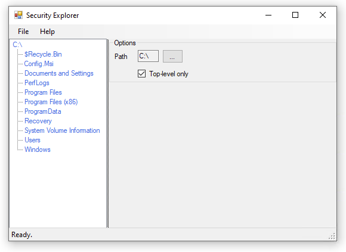

# SecurityExplorer
Windows Explorer-based interface for viewing file and folder security

Currently incomplete - right now, the app will prompt for a folder (including the root of a drive) and display the files and folders inside it via a treeview, but it does nothing more.

The intention is to show the security permissions per file and folder, and to highlight those which differ from their parent so you can easily locate and adjust them.

This is for use by systems administrators, say, when you inherit a company's fileshare that has multitudes of differing permissions all over and you want to get a hold of what's going on.

----
This project slowed down because I went from Windows to a Mac but now have Parallels and an AWS Workstation running so I'll be getting this going again. I don't think I will offer it up to Hacktober again though - I had three pieces of work submitted, of which one was good and helpful, and two were not.
